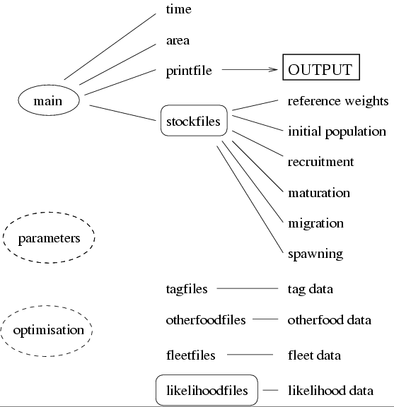

Gadget is the Globally applicable Area Disaggregated General Ecosystem Toolbox.

Welcome to the Gadget development repository. This will eventually contain all the information you ever wanted to know about Gadget, but were afraid to ask. For the time being, however, the information is a bit sparse but we hope that it will grow quickly.

Gadget is a statistical model of marine ecosystems. Gadget models can be both very data- and computationally- intensive. Various scripts have been written to extract data from data warehouses using [mfdb](https://github.com/mareframe/mfdb/), a specialised R-package, that can handle the complexities of the disparate datasets that can be used by Gadget when estimating model parameters. To speed up processing time, a parallel processing optimiser (called [Paramin](https://github.com/Hafro/paramin)) has been developed. In addition to these a specialised R-package, [Rgadget](https://github.com/Hafro/rgadget), has been developed to aid in the development of Gadget models by providing tools to estimate likelihood weights, defining model skeletons, and model diagnostics and prognosis.   

# Features
Gadget is a software tool that can run complicated statistical ecosystem models, which take many features of the ecosystem into account. Gadget works by running an internal model based on many parameters, and then comparing the data from the output of this model to ''real'' data to get a goodness-of-fit likelihood score. These parameters can then be adjusted, and the model re-run, until an optimum is found, which corresponds to the model with the lowest likelihood score.

Gadget allows you to include a number of features into your model: One or more species, each of which may be split into multiple stocks; multiple areas with migration between areas; predation between and within species; maturation; reproduction and recruitment; multiple commercial and survey fleets taking catches from the populations.

An indication of the features that Gadget can model can be given by
looking at the data input files required shown in the diagram below:

These input data files are in a column-based format, which means that they can easily be generated using simple extraction routines from databases. This means that the construction of a Gadget model can be done reasonably quickly, and the models will be free of any formatting errors in the Gadget input files that could prevent Gadget models from running. The data format is explained in more detail in the [Gadget User Guide](http://www.hafro.is/gadget/userguide/userguide.html).

# Prerequisites
To compile Gadget one needs a working C++ compiler and a version of Make installed on the computer:

## Linux
This should be install automatically on most distributions but on ubuntu one needs to install build-essentials:

>  sudo apt-get install build-essential
  

## MacOsX
It should be sufficient to install XCode through the Appstore and through XCode's preferences install commandline tools

## Windows
Easiest way is to install [Rtools](https://cran.r-project.org/bin/windows/Rtools/) . During the install process allow the installer to append to the system path.

# Compile and install
To install Gadget you can simply click the "download as a zip file" button (or clone the repository). Unzip this file and within command prompt/terminal application make your way to the resulting folder, typically called `gadget-master`, and simply type:
  
>  make
  
For convenience you may want to install the resulting gadget executable to a location in the system path, thus allowing the gadget executable to called in any directory. On *nix based system you can simply type:
  
>  sudo make install 

# Acknowledgements
This project has received funding from an EU grant QLK5-CT199-01609 and the European Union’s Seventh Framework Programme for research, technological development and demonstration under grant agreement no.613571.

